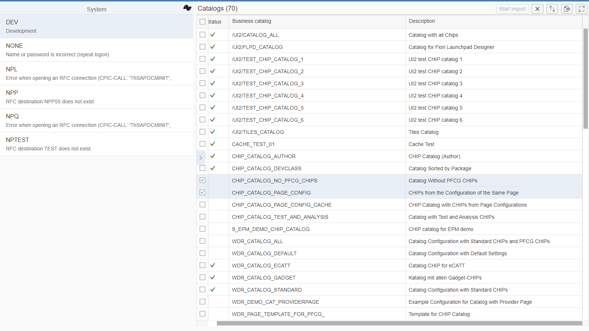

# Catalog Import

The tool lets you list the catalogs from all your systems and import them to [Fiori Tracker Core](prod.ci.compatibleCoreLink) for documentation purposes (stored as so-called "To-be" records). Catalog Import uses free ["As-is" API](ci.compatibleAsisMainLink).

## [Installation](inst.md)

## Dependencies
Requires: [As-is API]({{ prod.ci.2020FPS01.compatibleAsisMainLink }}) (free)

## Location
Located on Central system

## Available extensions
None.

## Other applications that might use the product
[Fiori Tracker Core]({{ prod.ci.2020FPS01.compatibleCoreLink }})

## [Technical information](tech.md)

