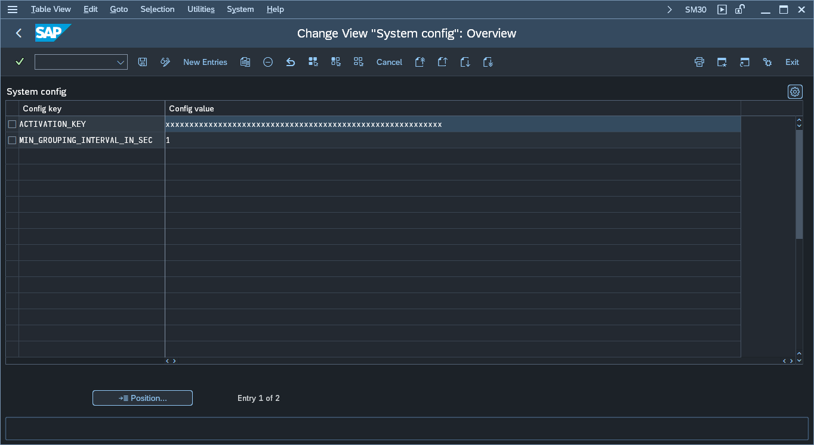

# Step 5 - Enter the activation key

1. Go to transaction *zciadmin* and press button labeled: *2. Edit configuration*. This will open a maintenance view for table ZNYPECI_SC:

2. In configuration table add the following entry:

|Config key|Config value|
|--|--|
|ACTIVATION_KEY|*key provided by Nype's representative*|