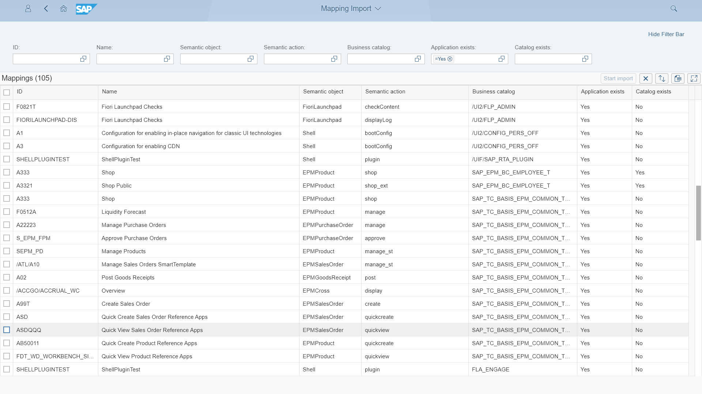

# Mappings Import

The tool lets you list applications with tits mappings to catalogs and import them to [Fiori Tracker Core]( {{ prod.ai.R2020FPS01.compatibleCoreLink }} ) for documentation purposes (stored as so-called "To-be" records). Mappings Import uses free ["As-is" API]({{ prod.ai.R2020FPS01.compatibleAsisMainLink }}).

## [Installation](inst.md)

## Dependencies
Requires: [As-is API]({{ prod.mi.R2020FPS01.compatibleAsisMainLink }}) (free)

## Location
Located on Central system

## Other applications that might use the product
[Fiori Tracker Core]({{ prod.mi.R2020FPS01.compatibleCoreLink }}) (free)

